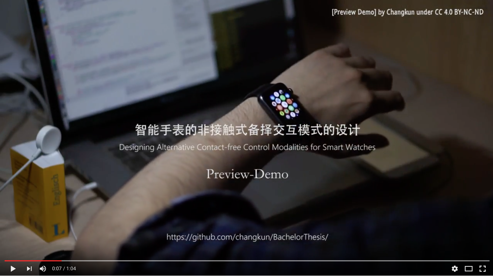

# 智能手表的非接触式备择交互模式的设计

中文 | [English](./README.md)

本项目中包含了毕业设计中的全部代码、文章及相关成果。

<a name="index"/>
## 目录
* [部署方法](#setup)
* [文件说明](#files)
* [演示](#demo)
* [从设计中析出的项目](#external)
* [许可](#license)

<a name="setup"/>
## 部署方法

本项目的软件由两个部分组成：

1. **客户端**：iOS & WatchOS 数据交换、效果呈现的部分；
  - 客户端部署方法请查看：[客户端说明](./client/README-cn.md)

2. **服务端**：数据分析、交换、手势识别的部分。
  - 服务端部署方法请查看：[服务端说明](./server/README-cn.md)

<a name="files"/>
## 文件说明

* [client](./client)
  - 此文件夹中包含了客户端(iOS 与watchOS) 的 Swift 源码；
* [demo](./demo)
  - 此文件夹中包含了演示图片；
* [docs](./desktop)
  - 此文件夹中包含了项目中产生的相关文档，包括申报表、架构图源文件、答辩Keynote、导师评语等；
* [experiment](./experiment)
  - 此文件夹中包含了项目中有关用户调研的全部数据、文档、代码等文件；
* [paper](./paper)
  - 此文件夹中包含了毕业设计论文及其 LaTeX 源码；
* [server](./server)
  - 此文件夹中包含了服务端的 NodeJS 源码；

<a name="demo"/>
## 演示

* [YouTube 源](https://www.youtube.com/watch?v=ef2pKK6b0UA&list=PLwUqqMt5en7c2QaQ_DkuvZm9dGTz6RjRM)：

* [腾讯视频源](http://v.qq.com/page/b/a/z/b0198gu45az.html)

<a name="external"/>
## 从论文中析出的项目

* [SWUNThesis](https://github.com/changkun/SWUNThesis): 西南民族大学本科毕业设计 LaTeX 模板
* [LeapDocCN](https://github.com/changkun/LeapDocCN): LeapMotion SDK 官方文档中文翻译

<a name="license"/>
## 许可

1. 本项目中所有内容（除论文、代码外）采用<a rel="license" href="http://creativecommons.org/licenses/by-nc-sa/4.0/">知识共享署名-非商业性使用-相同方式共享(BY-NC-SA) 4.0 国际许可协议</a>进行许可。

2. 所有代码均采用 [GNU Public Licence v3](./LICENSE) 进行许可。

3. 而[中文论文](./paper/main-cn.pdf) 和 [英文论文](./paper/main-en.pdf) (包括[其余发布版本](./paper/release/)) 均为 欧长坤版权所有©2016年. 保留所有权利.
